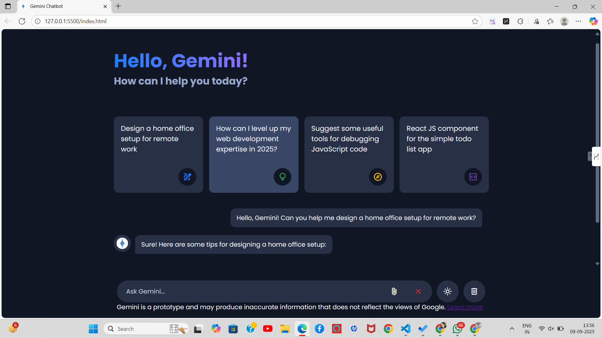

# 🤖 Gemini Chatbot

A simple AI-powered chatbot built with **HTML, CSS, and JavaScript** using the **Google Gemini API**.  
It supports text input, file uploads, typing animation, and theme switching.

---

## ✨ Features
- 💬 Real-time chat with Gemini API  
- ⏳ Typing effect for bot replies  
- 🌙 Dark / Light theme toggle  
- 📎 File upload (images + documents)  
- ⛔ Stop response button  
- 🗑️ Clear chat history  

---

## 🛠️ Tech Stack
- **Frontend:** HTML, CSS, JavaScript  
- **AI API:** Google Gemini 2.5 Flash  

